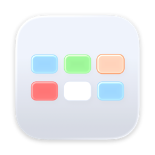
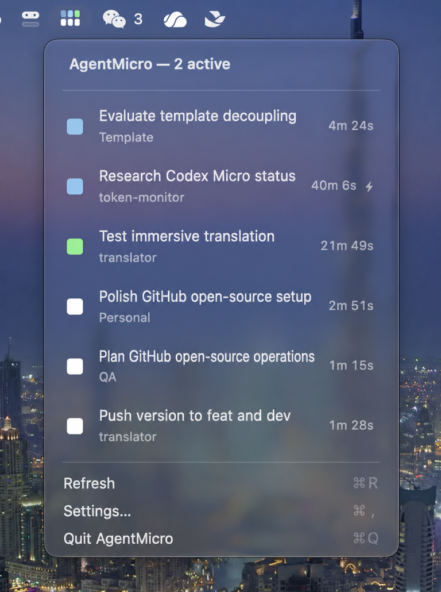

<div align="center">



# AgentMicro

### macOS 菜单栏里的 Codex 实时任务状态

[](https://github.com/fizzy718/AgentMicro/actions/workflows/ci.yml)
[](https://github.com/fizzy718/AgentMicro/releases/latest)
[](https://github.com/fizzy718/AgentMicro/releases/latest)
[](https://github.com/fizzy718/AgentMicro)
[](https://swift.org)
[](LICENSE)

[网站](https://agentmicro.cc) · [下载](https://github.com/fizzy718/AgentMicro/releases/latest) · [English](README.md)

</div>

AgentMicro 是一个本地优先的 macOS 菜单栏应用，帮助同时运行多个 Codex 任务的用户快速了解：哪些任务仍在工作、哪些任务需要处理、哪些任务已经产生未读结果，以及如何一键返回对应的 Codex Desktop 会话。

**开源、本地优先、只读观察：** AgentMicro 只在你的 Mac 上读取任务状态，不会上传 Prompt、源代码、回复或任务历史。

AgentMicro 是基于优秀开源项目 [CodexBar](https://github.com/steipete/CodexBar) 开发的独立社区项目，与 OpenAI 或 CodexBar 维护者不存在隶属或官方背书关系。

## 界面

<p align="center">
  
</p>

界面信息含义：

- 正在运行的任务始终置顶，顶部显示当前运行数量。
- 左侧圆角矩形使用下方定义的五种任务状态色。
- 右侧数字是当前单个 turn 的运行时长，不是任务创建至今的时间。
- 时长后的闪电表示该任务启用了 Codex 快速模式。

## 为什么做 AgentMicro？

- **不用反复打开 Codex。** 正在运行的任务置顶，其余任务按照最近状态变化排序。
- **一眼看懂状态。** 菜单栏六块图标对应最前面的六个任务，工作时按环形顺序呼吸。
- **快速返回任务。** 点击 Codex Desktop 任务即可打开相应会话。
- **任务数据留在本机。** AgentMicro 只读取已知的本地 Codex 进程与会话元数据，不上传 Prompt、回复、源代码、命令输出或任务状态。

## 任务状态

AgentMicro 对外只使用五种状态：

| 指示 | 状态 | 含义 |
| --- | --- | --- |
| ⬜ | 空闲 | 任务存在，但当前没有活动。 |
| 🟩 | 未读 | 已产生新结果，尚未查看。 |
| 🟦 | 思考 | Codex 正在处理任务。 |
| 🟧 | 需要处理 | Codex 要求用户批准、回答，或完成浏览器输入等交互步骤。 |
| 🟥 | 错误 | 当前执行失败或遇到阻塞错误。 |

证据不足时内部状态为 `unknown`，界面仍显示为空闲白色，不增加一个容易误解的第六种颜色。

## 功能

- 观察本机 Codex Desktop 和 Codex CLI 任务。
- 监听本地会话变化，并使用短周期轮询兜底。
- 使用 Codex 本地未读线程状态同步 Desktop 已完成任务；从 AgentMicro 打开的结果会立即完成绿色到白色的已读闭环。
- 可选“增强状态检测”可补充识别 Codex 当前选中的任务和可见审批／错误控件；默认关闭，普通模式不需要辅助功能权限。
- 明确把操作权交给用户后持续显示橙色，直到用户继续任务。
- 正在工作的任务优先，其余任务按最近状态变化排序。
- 显示项目名、任务标题和精确到秒的当前单轮时长。
- Codex 使用快速模式时，在时长旁显示闪电标记。
- 可在设置中显示最近 1–20 个任务。
- 支持任务标题、仅项目名、任务标题与项目名三种显示方式。
- 支持开机启动和最近完成任务保留。
- 默认跟随 macOS 系统语言，并提供 23 种界面语言。
- 应用图标采用六层矢量结构，支持系统 Default、Dark、Clear 和 Tinted 外观。
- 正式签名版本支持独立的 Sparkle 在线更新源。

## 安装

### 系统要求

- macOS 14 Sonoma 或更高版本
- 已产生本地会话的 Codex Desktop 或 Codex CLI

正式签名和 Apple 公证的安装包发布在 [GitHub Releases](https://github.com/fizzy718/AgentMicro/releases)。优先下载 DMG：打开后将 `AgentMicro.app` 拖到 Applications 文件夹，再从 `/Applications` 启动。仅提供 ZIP 的旧版本，解压后手动移动到 `/Applications` 即可。

### Homebrew

也可以通过官方 Tap 安装同一份已签名并经 Apple 公证的正式版本：

```bash
brew install --cask fizzy718/tap/agentmicro
```

使用 `brew upgrade --cask fizzy718/tap/agentmicro` 更新。等 AgentMicro 被
Homebrew Cask 主仓库收录后，即可使用更短的 `brew install --cask agentmicro`。

### 从源代码构建

需要安装包含 Swift 6.2 或更高版本的 Xcode：

```bash
git clone https://github.com/fizzy718/AgentMicro.git
cd AgentMicro
make agentmicro-package
open AgentMicro.app
```

开发运行：

```bash
make agentmicro-start
make agentmicro-stop
```

本地开发包使用 ad-hoc 签名，因此不会伪装成可以自动更新的正式版本。正式版本使用 AgentMicro 独立更新源、Developer ID 签名、Apple 公证和 Ed25519 更新签名。

## 隐私

AgentMicro 坚持本地优先、只读观察：

- 只读取已知的 Codex 进程和本地会话位置。
- 不需要 Full Disk Access。
- 不读取 Keychain。
- 不会把任务标题、Prompt、回复、源代码、命令输出或会话文件发送到服务器。
- 可选的软件更新功能只访问 AgentMicro 更新源。
- 任务标题在共享屏幕上仍可能包含敏感信息，设置中可以切换为“仅项目名”。

## 当前范围

AgentMicro V1 专注于观察任务并返回对应的 Codex 会话。它不会批准操作、停止或继续任务、修改 Codex 状态、监控 Token 额度或上传任务历史。

仓库目前仍保留从 CodexBar 底座继承的其他 Provider 实现与测试，但它们没有接入
AgentMicro 菜单，也不是 AgentMicro 对外提供的功能；V1 有意保持 Codex-only。

Codex 目前没有为全部 Desktop 任务状态提供稳定的公开事件接口，因此 AgentMicro
根据有界的本地元数据和 rollout 事件归纳生命周期，并从 Codex 本地未读线程状态同步
Desktop 已完成任务是否已查看。从 AgentMicro 成功打开某个准确任务属于更强的单任务查看证据，
会立即把这次完成从绿色改为白色；之后出现新结果时仍会重新变绿。CLI 任务继续使用
AgentMicro 本地已读记录。用户也可以主动开启“增强状态检测”，让 AgentMicro 在 Codex 位于前台时
只读识别唯一选中的任务和可见审批／错误控件。该功能默认关闭，只有主动开启后才请求辅助功能权限，
且不会点击、输入、批准或发送任何内容。项目会优先显示诚实的空闲状态，而不是包装成确定结论；
本地文件尚在落盘时仍可能存在短暂差异。

## 开发

AgentMicro 入口位于 `Sources/AgentMicro`，可复用的本地会话发现逻辑保留在 `Sources/CodexBarCore`。

```bash
# AgentMicro 聚焦测试
AGENTMICRO_BUILD_ONLY=1 swift test \
  --disable-automatic-resolution \
  --filter AgentMicro

# 仓库完整检查
make check
make test
```

产品决策和实现约束见英文 [AgentMicro 产品文档](docs/agentmicro/README.md)，签名与在线
更新流程见英文 [AgentMicro 发布指南](docs/agentmicro/RELEASING.md)。项目只保留本页
作为中文 README，内部产品与工程文档统一使用英文维护。
Codex Micro 原厂行为、第三方观察与 AgentMicro 取舍见英文
[Codex Micro 功能模型](docs/agentmicro/CODEX_MICRO_REFERENCE.md)。

## 参与贡献

欢迎提交 Issue、聚焦的 Pull Request、翻译、可复现的状态同步报告和文档改进。提交代码前请阅读 [CONTRIBUTING.md](CONTRIBUTING.md)，报告安全问题前请阅读 [SECURITY.md](SECURITY.md)。

请勿在公开 Issue 中附加真实 Codex Prompt、源代码、凭据或未经脱敏的 rollout 文件。

## 交流群

欢迎加入 AgentMicro 社区，讨论使用体验、状态识别、翻译和开发：

- [Telegram 讨论群](https://t.me/+844ZOEqapkI5OTBh)
- 微信群：扫描下方二维码。

<p align="center">
  
</p>

本邀请二维码有效期至 2026 年 8 月 5 日。微信群邀请二维码会定期更新，到期后仓库会替换图片。

## 上游与致谢

AgentMicro 衍生自 Peter Steinberger 创建的 [steipete/CodexBar](https://github.com/steipete/CodexBar)。CodexBar 使用 MIT License。AgentMicro 复用了其中一部分 macOS 应用底座、本地会话发现、国际化约定和 Sparkle 更新架构，并在此基础上开发独立的 Codex 任务观察产品。

原 CodexBar 版权和 MIT 许可声明保留在 [LICENSE](LICENSE)，更完整的来源说明见 [NOTICE.md](NOTICE.md)。

## 许可证

MIT，详见 [LICENSE](LICENSE)。
