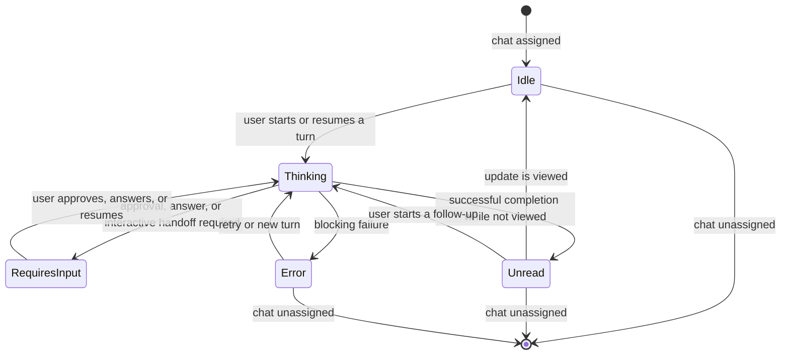

# Codex Micro Functional Model

Updated: 2026-07-29

## Purpose

This document models Codex Micro as a product and records the evidence AgentMicro uses when adopting its task semantics. It is a reference, not a claim that AgentMicro is Codex Micro or that private implementation details are stable APIs.

Every statement belongs to one of three evidence levels:

- **Official**: published by OpenAI in product documentation or the Supply Co. product page.
- **Observed**: reported by independent coverage or recovered from a specific installed ChatGPT build by the local `freemicro` research project.
- **AgentMicro decision**: a product or engineering choice made here because Codex does not expose the same internal state surface publicly.

## Sources

### Official

- [OpenAI Codex Micro documentation](https://learn.chatgpt.com/docs/features/codex-micro)
- [OpenAI Supply Co. × Work Louder product page](https://openai.com/supply/co-lab/work-louder/)
- [OpenAI Codex changelog](https://learn.chatgpt.com/docs/changelog)

### Independent coverage

- [Ars Technica: OpenAI's first branded hardware is a light-up keyboard](https://arstechnica.com/ai/2026/07/openais-first-branded-hardware-is-a-light-up-keyboard/)
- [TechRadar: What is the Codex Micro?](https://www.techradar.com/ai-platforms-assistants/openai/what-is-the-codex-micro-openais-first-hardware-gadget-explained)
- [Axios: OpenAI launches a keypad for AI agents](https://www.axios.com/2026/07/15/openai-keyboard-codex-agents)

Independent coverage is useful for product framing and user expectations. It is not used as an implementation contract when it conflicts with official documentation or direct evidence.

### Local implementation research

- `../freemicro/docs/FACTORY-DEFAULTS.md` in the neighboring `freemicro` checkout.
- `../freemicro/docs/AUDIT.md` in the neighboring `freemicro` checkout.
- The neighboring `abtop` and `opendeck` checkouts for lifecycle-reducer and owned-session comparisons.

The `freemicro` findings come from one packaged ChatGPT build and may change without notice. They are treated as observed behavior, not a supported API.

## Product Thesis

**Official:** Codex Micro is a limited-run Codex and Work Louder collaboration that turns parallel ChatGPT/Codex chats into a glanceable physical control surface. Its primary value is reducing context switching: users can see several agents' states, jump to a chat, and trigger common actions without leaving the keyboard.

**Independent interpretation:** Reviews consistently describe it as a six-agent status dashboard more than a conventional keyboard. Coverage also raises two product risks: a high price for a specialized controller and the safety cost of placing approval on a physical shortcut. Those observations reinforce AgentMicro's read-only V1 boundary.

## Actors and Responsibilities

| Actor | Responsibility |
| --- | --- |
| User | Starts work, reviews results, supplies answers or approvals, and chooses the selected chat. |
| ChatGPT desktop app | Owns chat state, unread state, selection, control mappings, and the device connection. |
| Codex chat | Owns the agent turn, local/remote execution state, result, and user-blocking requests. |
| Agent Key | Represents one assigned chat and presents its current status. |
| Command Key | Triggers a mapped ChatGPT action such as Fast, Approve, Decline, Fork, Mic, or Send. |
| Analog stick | Triggers one of four mapped commands after crossing a directional threshold. |
| Dial | Navigates composer controls or directly adjusts reasoning effort. |
| Work Louder Input | Configures non-Codex layers; Codex itself uses layer 1. |

## Core Object Model

### Chat

A chat is the durable unit users recognize and return to.

```text
Chat
├── identity
├── host/source: local or remote
├── execution: idle, working, blocked, failed, or completed
├── unread update: yes/no
├── selected: yes/no
└── assignment: zero or one Agent Key in the current layout
```

### Agent Key Slot

Codex Micro has six Agent Key slots. A slot contains:

- A stable position from 1 to 6.
- Zero or one assigned chat.
- One semantic status.
- One status color.
- A selected presentation flag.

An unassigned slot is off. Assignment and status are separate: changing which chat a key follows does not change the color vocabulary.

### Control Mapping

Command Keys, the four analog directions, and the dial have configurable actions. Agent Keys are not extra Command Keys; their role remains chat assignment, status, and navigation.

## Assignment Model

**Official:** Codex Micro exposes four Agent source modes:

1. **Most recent chats** — the six most recently updated chats, pinned or unpinned.
2. **Pinned chats** — the first six pinned chats.
3. **Priority chats** — chats waiting for input, then unread and active chats first.
4. **Custom assignments** — a specific chat per key; an unassigned key can start a new chat that becomes assigned to it.

The factory default is the six most recently updated chats.

**AgentMicro decision:** AgentMicro is a passive menu, not a programmable hardware layout. It currently sorts working tasks first and then by recent state change, shows a configurable 1–20 rows, and mirrors the first six rows in the menu bar icon. This is closest to a hybrid of Codex Micro's Priority and Most recent modes; it is intentionally not presented as the factory assignment algorithm.

## Five-State Model

### Public semantics

| Light | Codex Micro status | Predicate |
| --- | --- | --- |
| White | Idle | The assigned chat has no active work or unread result. |
| Blue | Thinking | ChatGPT is working. |
| Green | Complete | The chat completed and has an unread update. |
| Amber | Requires input | ChatGPT needs an approval or response. |
| Red | Error | Something went wrong. |
| Off | No assigned chat | No chat is assigned to the key. |

Green is not a permanent “done” state. Its predicate explicitly contains `unread`, so viewing the update removes the reason for green.

### Observed local precedence

The local `freemicro` reverse engineering recovered this local-chat precedence from one ChatGPT build:

```text
error
  > approval request
  > response request
  > loading/working
  > unread output
  > idle
```

For remote tasks, the observed order is failed, pending/in-progress, unread turn, then idle.

This precedence explains an important behavior: a chat that is both unread and waiting for approval is amber, not green. Actionable blocking state outranks passive unread state.

### State transition loop



The official documentation defines the states and their meanings but does not publish a complete transition table. Transitions above are a combination of those predicates and observed behavior.

### Selected and viewed behavior

**Official:** one press selects the assigned chat without bringing ChatGPT forward; two presses within 350 ms select it and bring ChatGPT forward. The selected chat's key pulses using its existing status color.

**Observed:** the investigated ChatGPT build downgrades `unread` to `idle` when that thread is selected and the app window is focused. The same build uses a breathing effect for the selected key.

These are different concepts:

- `selected` controls the pulse effect.
- `viewed` clears the unread predicate.
- A selected chat that is not actually visible should not automatically clear unread.

The practical closure rule is:

```text
successful completion + not viewed = green
successful completion + viewed = white
newer completion after that view = green again
```

## Lighting Model

### Official behavior

- Status colors are fixed even when assignments change.
- The selected chat's Agent Key pulses in its status color.
- Brightness is configurable.
- Lights turn off after three minutes of inactivity by default and wake when the device is used or an Agent Key changes status.
- Voice recording uses a moving sea-green light; processing uses moving white; prompt-ready is solid white.

### Observed factory values

The neighboring `freemicro` research recovered the following values from one packaged build:

| Semantic state | Observed hardware color | Effect |
| --- | --- | --- |
| Idle | `#FFFFFF` | Solid |
| Thinking | `#304FFE` | Solid |
| Complete/unread | `#00FF4C` | Solid |
| Requires approval/response | `#FF6D00` | Solid |
| Error | `#FF0033` | Solid |
| Selected | Same status color | Breath, speed `0.4` |

These exact values and effect parameters are implementation observations, not values published in OpenAI's public documentation. AgentMicro keeps its current macOS-legible palette while preserving the same five semantics.

## Input and Navigation Model

### Agent Keys

- Single press: switch chat, do not force ChatGPT to the foreground.
- Double press within 350 ms: switch chat and foreground ChatGPT.

### Default Command Keys

| Command | Default behavior |
| --- | --- |
| Fast | Toggle Fast mode. |
| Approve | Approve the current request. |
| Decline | Decline the current request. |
| Fork | Continue the current chat in a new chat. |
| Mic | Hold for push-to-talk; double press for hands-free recording. |
| Codex | Send the composer message. |

### Analog Stick

The default directions are Plan mode, forward, sidebar visibility, and back. Each direction can be remapped to an available desktop command or enabled skill.

### Dial

The dial either navigates composer controls or adjusts reasoning effort directly. When a composer control or menu is open, the Agent Key immediately to the right of the dial becomes a red cancel key.

## Settings and Lifecycle

ChatGPT reveals Codex Micro settings after detecting the device. Settings cover:

- Agent source and custom Agent Key assignment.
- Command Key and analog-direction mappings.
- Dial mode.
- Brightness and lighting timeout.
- Battery information when reported by the hardware.

On macOS, ChatGPT requires Input Monitoring to receive device key presses. Codex uses device layer 1; Work Louder Input can configure up to five additional layers for other applications.

## Implications for AgentMicro

### What AgentMicro should reproduce

- Exactly five user-facing task semantics.
- Green as transient unread attention, never as historical completion.
- Actionable states outranking unread.
- A stable chat identity behind each visible slot.
- The same state source for compact icon and expanded rows.
- Explicit separation between state, selection, and animation.

### What AgentMicro should not claim

- Hardware control, device pairing, or command execution.
- Exact parity with ChatGPT's private thread resolver.
- Support for Codex Micro assignment modes that are not implemented.
- An authoritative selected-thread signal when Codex does not publish one.

### Read-evidence precedence

AgentMicro's Desktop read resolver uses this order:

1. A newer completion invalidates every older local read marker.
2. A successful exact AgentMicro navigation or a completion observed while that task is being viewed marks that exact completion read.
3. Without explicit local evidence, Codex's persisted unread-thread set remains the primary Desktop source.
4. A fresh Codex snapshot that omits the thread can mark the completion read.
5. Missing or malformed Codex state never means “all read.”

This ordering prevents a stale persisted unread bit from resurrecting green after AgentMicro has direct evidence that the user opened the task. A failed deep link or generic application activation is not counted as a Desktop view. Newer activity also prevents a local read marker from hiding a later result.

### Base and Enhanced observation

Codex does not currently expose a supported public event for “the user selected thread X in the Desktop sidebar.” AgentMicro therefore has two observation levels:

- **Base mode, default:** uses rollout events, Codex's persisted unread-thread set, and successful exact AgentMicro navigation. It never asks for Accessibility permission. Direct Codex-side viewing still depends on Codex persisting its unread update.
- **Enhanced Status Detection, optional:** after the user explicitly enables it and grants macOS Accessibility permission, reads only the currently visible Codex window's accessibility tree. A unique selected task title is task-specific view evidence; paired approve/reject controls are needs-input evidence; a visible blocking error dialog is error evidence.

Enhanced detection is deliberately fail-closed. A project-only or ambiguous label does not select a task, a single generic button does not imply approval, and losing permission returns to base mode. It observes the UI but never clicks, types, approves, declines, or modifies Codex.

Neither level is a supported upstream event API. Accessibility labels and Codex's local state can change across releases, so rollout evidence remains the primary lifecycle source and a stable public Codex event transport remains preferable.

## Product Invariants

1. Green must always be explainable as a currently unread result.
2. Viewing a result must not suppress a later result.
3. Amber must represent a concrete user dependency, not ordinary thinking text.
4. Error must represent a blocking failure, not a recovered warning.
5. Unknown evidence must not invent a sixth public color.
6. Ordering and animation must not change task meaning.
7. A source with lower confidence must not override a newer, task-specific observation.
8. Accessibility is opt-in enhancement, never a launch requirement.
